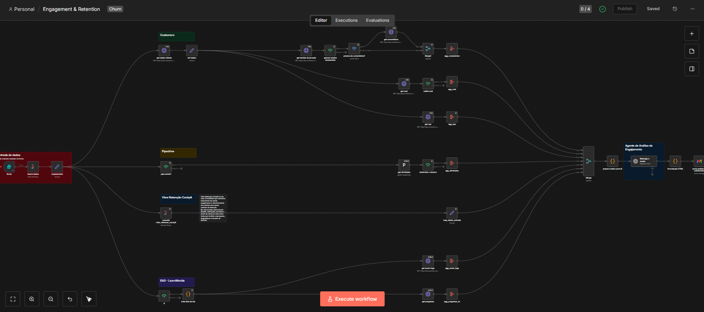

AI-Powered Retention & Engagement Analysis (n8n + SQL + LLM)

Este projeto apresenta um sistema avançado de BI Reativo e Análise Preditiva de Churn desenvolvido no n8n. O fluxo integra dados de múltiplas plataformas (CRM, Suporte, EAD e ERP) para gerar diagnósticos automáticos sobre a saúde do cliente.

🚀 Competências Técnicas Destacadas
Arquitetura de Dados (SQL Customizado): Desenvolvimento integral da view_retencao_cockpit em MS SQL Server. Esta view consolida indicadores de saúde, uso de módulos e sinais de risco (inadimplência, baixa atividade) em uma única fonte de verdade.

Engenharia de Prompt & IA: Implementação de agentes de IA (LLM) utilizando JSON Schema para extração de insights qualitativos de feedbacks do NPS e tickets de suporte.

Integração de Ecossistema SaaS: Orquestração de APIs complexas, incluindo:

Pipedrive (Dados de CRM e atividades).

Movidesk (Tickets de suporte e CSAT).

CustomerX (Metas de sucesso e NPS).

LearnWorlds (Engajamento em treinamentos EAD).

Manipulação Avançada de Dados: Uso de JavaScript (Node.js) para sanitização de HTML, tratamento de arrays complexos e normalização de payloads para consumo da IA.

🛠️ O Diferencial: A Camada de Dados (SQL)
Diferente de automações simples, este fluxo é alimentado por uma View SQL robusta que eu mesmo desenhei. Ela não apenas entrega dados brutos, mas calcula variações de engajamento (últimos 30 dias vs anterior) e segmenta clientes por LTV Cluster, permitindo que a IA tome decisões baseadas em contexto financeiro e operacional real.

📊 Visão geral do fluxo de trabalho

